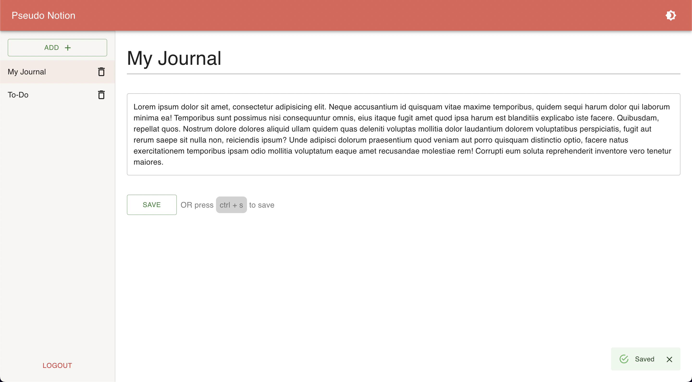

# Pseudo Notion

Make sure you ⭐️ this [`repository`](https://github.com/pettiboy/react-ui-scrollspy) if you find it helpful or interesting :)

Website similar to notion where you can create, view, update and delete pages.

## 🎞 Demo

### Try it your self [here](https://pettiboy.github.io/react-ui-scrollspy)!

| `Dark Mode`                              | `Light Mode`                               |
| :--------------------------------------- | :----------------------------------------- |
|  |  |

## 📝 Functionality

1. Sign In with Google
1. Create Page
1. Update Title and Content
1. Delete Page
1. Middleware to handle authentication
1. Light and Dark mode support
1. Material Design UI

## ⚙️ Tech Stack

1. `Firebase` - Authentication and Cloud Functions
1. `MongoDB` - Database
1. `Express` - Backend REST API
1. `React` - Frontend
1. `Material UI` - Styling

## 📝 Authors

Made with ❤️

- Hussain Pettiwala ([@pettiboy](https://github.com/pettiboy))
